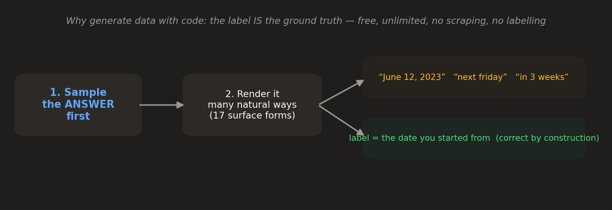
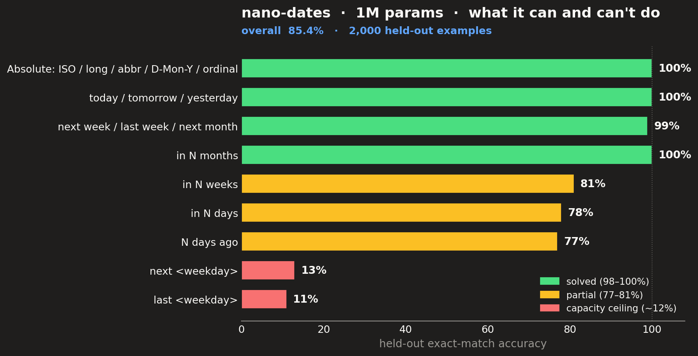

# nano-dates

Converts a natural date phrase ("next friday", "the 3rd of July 2025") to an
**ISO-8601** date, trained **entirely on data generated by code** — no scraping, no
labelling, no distillation from a larger model. A **~1M-parameter (1,016,960)
byte-level transformer** that runs on a CPU in milliseconds and trains from scratch
in ~30 seconds on one GPU.

> ### 📄 [**Read the technical report (PDF)**](nano-dates-report.pdf)
> A 3-page paper: the free-synthetic-data recipe, a data-leak bug that made an
> earlier model look perfect while it was cheating, and an honest map of where a 1M
> model's reasoning breaks. **[Open the PDF →](nano-dates-report.pdf)**

```
2024-03-10 | the 3rd of July 2025 => 2025-07-03
2024-03-10 | Jun 12 2023          => 2023-06-12
2024-03-10 | next week            => 2024-03-17
2024-03-10 | in 3 months          => 2024-06-10
```

- **Model + weights on Hugging Face:** https://huggingface.co/vukrosic/nano-dates
- **Technical report:** [nano-dates-report.pdf](nano-dates-report.pdf)

## Quick start (inference in 3 lines)

No framework required — just `torch`, `numpy`, `safetensors`:

```bash
git clone https://github.com/vukrosic/nano-dates && cd nano-dates
pip install -r requirements.txt
python -c "from modeling_nano_dates import load, parse; m=load(); print(parse(m,'2024-03-10','next month'))"
# -> 2024-04-10
```

```python
from modeling_nano_dates import load, parse

model = load("model.safetensors", "config.json")
parse(model, "2024-03-10", "the 3rd of July 2025")  # -> "2025-07-03"
parse(model, "2024-03-10", "next month")            # -> "2024-04-10"
```

`parse(model, today_iso, phrase)` takes the reference date `today_iso` (so relative
phrases like "tomorrow" are computable from the input) and the natural phrase, and
returns a 10-character ISO date string.

## Set it up with an AI agent

Paste this into Claude Code, Cursor, or any coding agent and it will clone, install,
and run nano-dates for you:

```
Set up the nano-dates model from https://github.com/vukrosic/nano-dates and run inference.

Steps:
1. git clone https://github.com/vukrosic/nano-dates && cd nano-dates
2. Create a venv and `pip install -r requirements.txt` (needs torch, numpy, safetensors).
3. The model is a single self-contained file, `modeling_nano_dates.py`, exposing two
   functions: `load(weights="model.safetensors", config="config.json")` returns the model,
   and `parse(model, today_iso, phrase)` returns an ISO-8601 date string.
4. Run a quick check:
     from modeling_nano_dates import load, parse
     m = load()
     for p in ["the 3rd of July 2025", "next month", "Jun 12 2023", "yesterday"]:
         print(p, "->", parse(m, "2024-03-10", p))
5. Report the outputs. Note the known limits (from the README / technical report):
   absolute dates and simple relatives are ~100%, variable-N day/week math is ~77-81%,
   and weekday phrases like "next friday" are ~12% — a 1M-param capacity ceiling, not a bug.
   Do NOT use this as a production date parser; it is a capability demo. For production,
   use dateutil/chrono.
```

## The idea: generate the data with code

A 1M-parameter model can't be a general assistant, but it *can* completely nail a
task that is **narrow and formally specified**. Date→ISO is exactly that — and that
makes the training data free:



You **sample the answer first**, then render it in many natural surface forms. Because
you started from the answer, the label is correct by construction — strictly better
than asking a big model to generate data (no verification, no cost, unlimited, and the
label *is* the ground truth, not a guess).

The model is given a **reference date** (`today`) at the start of the prompt, so
relative phrases ("tomorrow", "in 3 weeks") are computable from the input alone — it
never needs a wall clock. Prompt format, byte-for-byte:

```
<reference ISO date> | <phrase> => <answer ISO date>
```

## What it can and can't do

Held-out exact-match accuracy on 2,000 unseen examples (greedy decode):



| capability | accuracy |
|---|---|
| Parse absolute dates (`June 12, 2023`, `the 12th of June 2023`, …) | **100%** |
| Resolve simple relatives (today, tomorrow, next/last week, next month, in N months) | **98–100%** |
| Variable-N day/week arithmetic (in N days, N days ago, in N weeks) | **77–81%** |
| Weekday resolution (`next friday`) | **~12%** |
| **Overall** | **85.4%** |

The clean limitation is **weekday resolution**: it requires mapping an arbitrary date
to its day-of-week and then doing modular-7 arithmetic — the most globally entangled
computation in the set — and a 1M model doesn't have the capacity. Everything else it
does reliably. The full story is in the [technical report](nano-dates-report.pdf).

## The bug worth knowing about

An earlier version scored **100% on every absolute form** — and it was cheating. The
generator had set the prompt's reference date *equal to the absolute answer*, so the
model learned to **copy the ISO prefix** instead of reading the phrase. The held-out
eval confirmed the bug because it shared it. The only thing that caught it was feeding
the model an input the generator could never produce (a mismatched `today`).

The fix is one line of intent: absolute forms now sample an answer date **independent**
of `today`, so the only way to be right is to actually parse the phrase. `tests/`
includes a regression guard (`test_absolute_answer_decoupled_from_today`).

> Generated data being "correct by construction" does **not** mean it isn't leaking the
> answer through a side channel. Your evaluation will happily confirm a model that
> learned your bug.

## Reproduce it

Everything is here and self-contained:

```bash
python generate_data.py          # peek at the code-generated examples
python train.py                  # train from scratch (~30s GPU, a few min CPU)
python eval.py                   # per-category held-out exact-match (reproduces 85.4%)
python -m pytest tests/ -q       # label-correctness + no-answer-leak guards
```

| file | what it is |
|---|---|
| `modeling_nano_dates.py` | the model + inference (`load`, `parse`) — single file, no deps beyond torch/safetensors |
| `generate_data.py` | the 17 renderers and the code-generated data pipeline |
| `train.py` | prompt-masked SFT from scratch → `model.safetensors` |
| `eval.py` | batched greedy decode + per-category exact-match |
| `tests/` | the data really is labelled correctly, and doesn't leak the answer |
| `report/` | the PDF builder (`build_report.py`) and its figures |

## Model details

| | |
|---|---|
| Parameters | 1,016,960 |
| Architecture | decoder-only transformer, pre-norm (RMSNorm, RoPE, GQA, SwiGLU) |
| Tokenizer | raw UTF-8 bytes (vocab 256, no vocab file) |
| dim / layers / heads | 128 / 4 / 4 (2 KV heads) |
| Context | 64 bytes |
| Training | SFT, prompt-masked cross-entropy, 12k steps, AdamW, cosine LR 3e-3 |
| Data | 100k code-generated pairs, 17 surface renderers |
| Final val loss | 0.036 |

## Scope & honesty

This is a **method demonstration and a capability study**, not a production date
library — for real software, `dateutil`/`chrono` are exact and free. The value here is
showing how far a nano model gets on a formal task with synthetic data, and drawing a
legible line at where its reasoning breaks.

## What should this method point at next?

The model isn't the point — the **recipe** is: a narrow, formal task → sample the
answer first → render it many ways → a tiny model that nails it, for free. If you have
a narrow, formal, annoying task you wish a small reliable model could just *do* (parse,
normalize, validate, convert), open an issue — that's exactly the shape this fits.

## License

MIT — Copyright © 2026 Vuk Rosić
